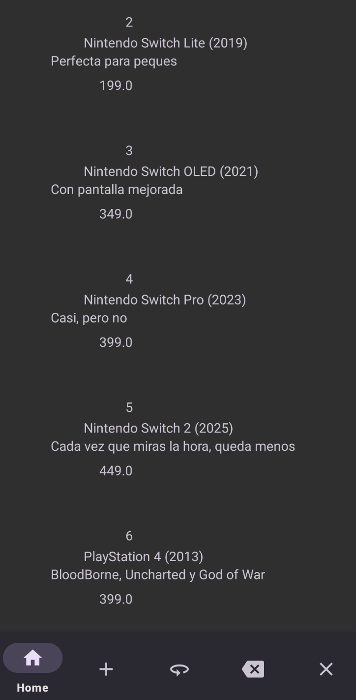
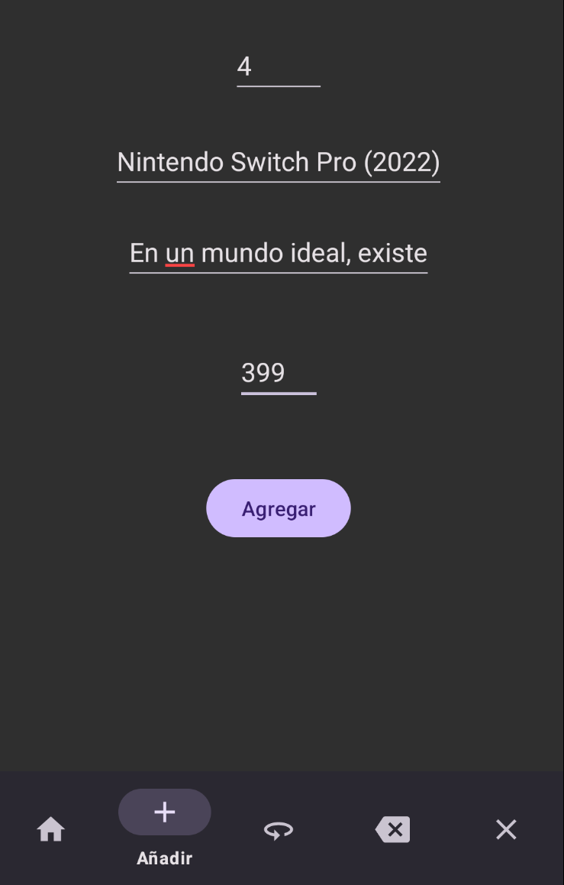
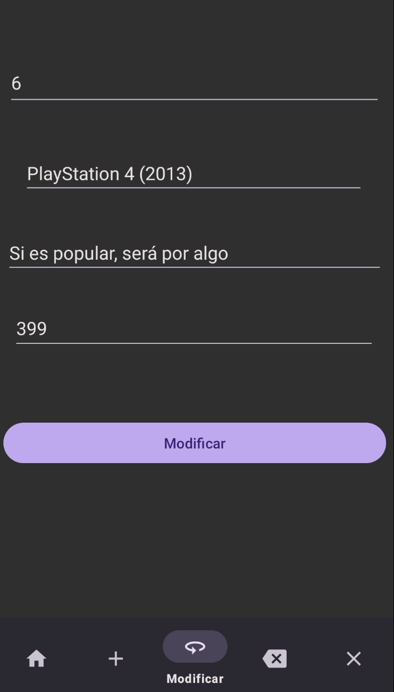
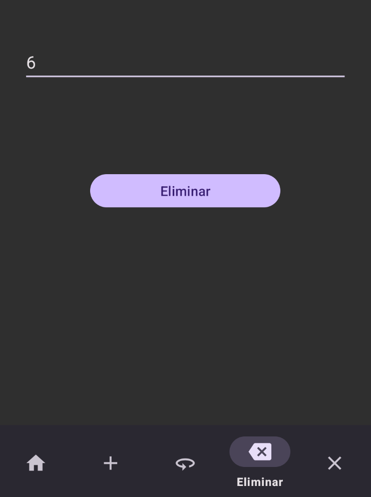

Proyecto de Base de Datos de Videojuegos y Consolas en Android Studio

¡WhatTheGame es una aplicación en la que se pueden registrar, modificar, eliminar y ver todos los elementos relacionados con el videojuego que el jugador quiera!
También tiene un sistema de login e inicio de sesión, para que, con unos pocos clicks, puedas registrarte y entrar.

Esta es la página en la que ver el logo con todo su esplendor, además de las opciones para crear usuario e iniciar sesión.

Aquí se ven listados todos los elementos de la base de datos; las consolas, videojuegos o merchandising que el usuario quiera añadir. 

Este es el modo para añadir elementos a la base de datos.

Este es el modo para modificar elementos de la base de datos.

Esta pantalla es sencilla pero práctica. Valiéndote del código, puedes eliminar el elemento que menos te guste. Curiosidad: esta clase está en Kotlin

Nota: todas las clases con EditText tienen código de validación que impide que todos los campos tengan su correcto contenido. 
Además, la inserción de código o precio solo puede ser números. Tampoco se puede crear dos usuarios con el mismo nombre, pero sí 2 usuarios con la misma contraseña.

Las imágenes reflejan un diseño intuitivo y una experiencia de usuario amigable. 
Cualquier persona puede usarlo sin necesidad de explicación previa. 

Este proyecto fue realizado para la API 34, soporta el SDK 34, y, según he visto, se puede usar el pretérito SDK 22 "minSdkVersion: 22".

Las dependencias principales:

androidx.appcompat:appcompat:1.6.1 Esto hace compatible mi aplicación con las características más recientes de Android.

androidx.compose.ui:ui Permite Interfaces de usuarios declarativas y componibles

com.google.android.material:material:1.10.0 Componentes de material design para android

Los implement principales: 

implementation ("com.squareup.picasso:picasso:2.8") permite la inserción sencilla de fotos.

implementation("androidx.navigation:navigation-fragment-ktx:2.7.6") también la compatibilidad con distintos fragment

implementation("com.google.android.material:material:1.10.0")

En este proyecto, se utiliza SQLite como base de datos local para almacenar y gestionar la información relacionada con los productos. SQLite es una base de datos ligera y ampliamente utilizada en aplicaciones móviles Android debido a su integración directa en el sistema operativo y su capacidad para manejar bases de datos locales de manera eficiente. En este contexto, se emplea SQLite junto con la clase AdminSQliteOpenHelper para crear, abrir y administrar la base de datos, así como para ejecutar consultas SQL para realizar operaciones CRUD (Crear, Leer, Actualizar y Eliminar) en la tabla de productos. Esta integración con SQLite permite que la aplicación almacene y acceda a la información de los productos de manera eficiente, proporcionando una experiencia fluida y rápida para el usuario.

